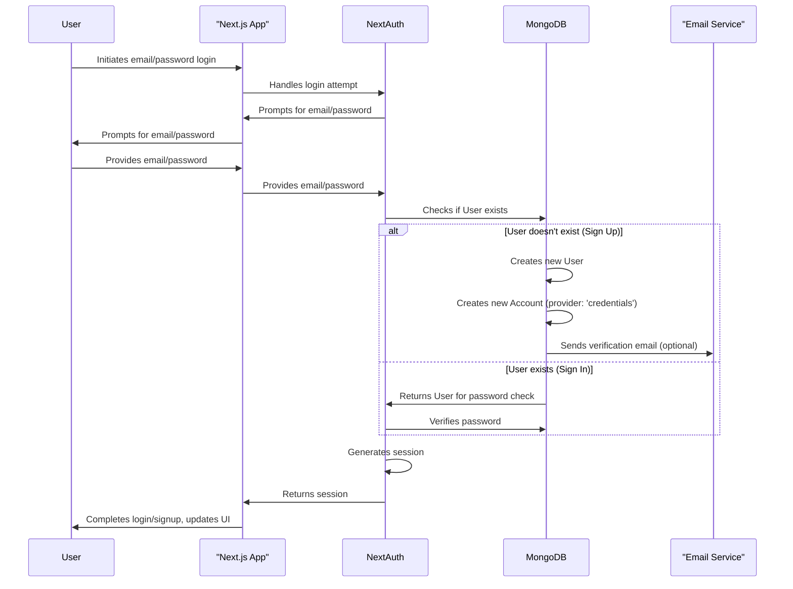

```mermaid
sequenceDiagram
participant User
participant "Next.js App"
participant NextAuth
participant MongoDB
participant "Email Service"

    User ->> "Next.js App": Initiates email/password login
    "Next.js App" ->> NextAuth: Handles login attempt
    NextAuth ->> "Next.js App": Prompts for email/password
    "Next.js App" ->> User: Prompts for email/password
    User ->> "Next.js App": Provides email/password
    "Next.js App" ->> NextAuth: Provides email/password
    NextAuth ->> MongoDB: Checks if User exists
    alt User doesn't exist (Sign Up)
        MongoDB ->> MongoDB: Creates new User
        MongoDB ->> MongoDB: Creates new Account (provider: 'credentials')
        MongoDB ->> "Email Service": Sends verification email (optional)
    else User exists (Sign In)
        MongoDB ->> NextAuth: Returns User for password check
        NextAuth ->> MongoDB: Verifies password
    end
    NextAuth ->> NextAuth: Generates session
    NextAuth ->> "Next.js App": Returns session
    "Next.js App" ->> User: Completes login/signup, updates UI
```
