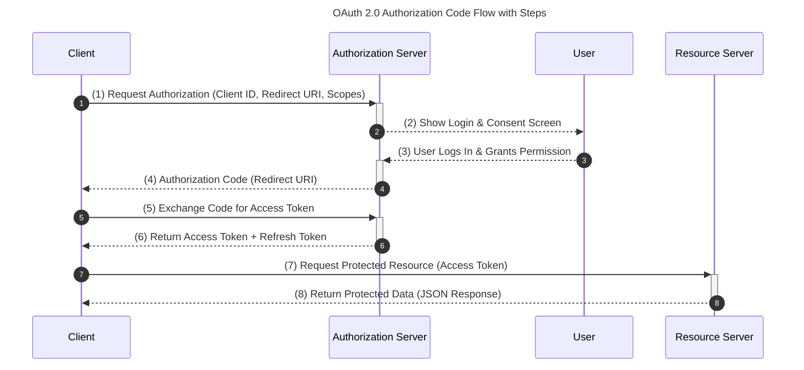

```mermaid
sequenceDiagram
    autonumber
    title OAuth 2.0 Authorization Code Flow with Steps

    Client->>+Authorization Server: (1) Request Authorization (Client ID, Redirect URI, Scopes)
    Authorization Server-->>-User: (2) Show Login & Consent Screen
    User-->>+Authorization Server: (3) User Logs In & Grants Permission
    Authorization Server-->>-Client: (4) Authorization Code (Redirect URI)

    Client->>+Authorization Server: (5) Exchange Code for Access Token
    Authorization Server-->>-Client: (6) Return Access Token + Refresh Token

    Client->>+Resource Server: (7) Request Protected Resource (Access Token)
    Resource Server-->>-Client: (8) Return Protected Data (JSON Response)
```
