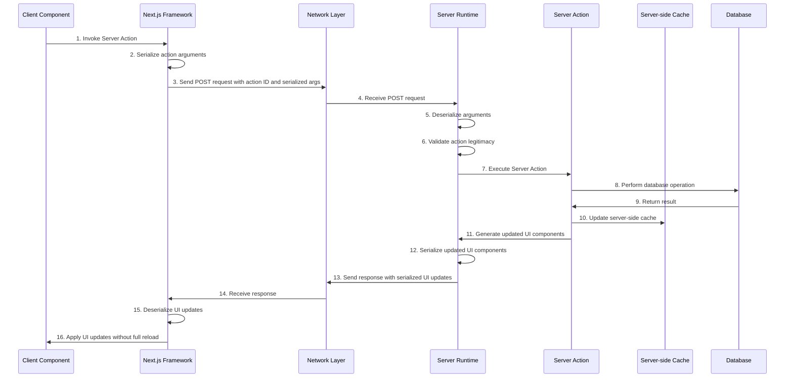

```mermaid
sequenceDiagram
    participant ClientComponent as Client Component
    participant NextJSFramework as Next.js Framework
    participant NetworkLayer as Network Layer
    participant ServerRuntime as Server Runtime
    participant ServerAction as Server Action
    participant ServerSideCache as Server-side Cache
    participant Database

    ClientComponent ->> NextJSFramework: 1. Invoke Server Action
    NextJSFramework ->> NextJSFramework: 2. Serialize action arguments
    NextJSFramework ->> NetworkLayer: 3. Send POST request with action ID and serialized args
    NetworkLayer ->> ServerRuntime: 4. Receive POST request
    ServerRuntime ->> ServerRuntime: 5. Deserialize arguments
    ServerRuntime ->> ServerRuntime: 6. Validate action legitimacy
    ServerRuntime ->> ServerAction: 7. Execute Server Action
    ServerAction ->> Database: 8. Perform database operation
    Database ->> ServerAction: 9. Return result
    ServerAction ->> ServerSideCache: 10. Update server-side cache
    ServerAction ->> ServerRuntime: 11. Generate updated UI components
    ServerRuntime ->> ServerRuntime: 12. Serialize updated UI components
    ServerRuntime ->> NetworkLayer: 13. Send response with serialized UI updates
    NetworkLayer ->> NextJSFramework: 14. Receive response
    NextJSFramework ->> NextJSFramework: 15. Deserialize UI updates
    NextJSFramework ->> ClientComponent: 16. Apply UI updates without full reload
```
