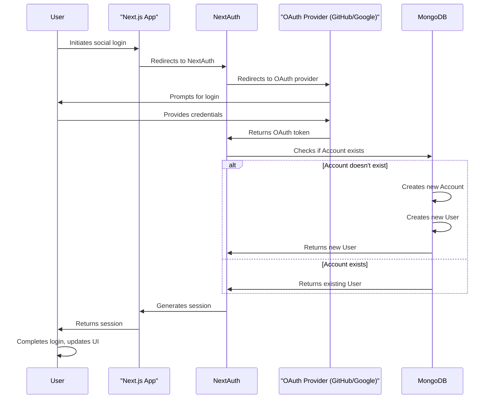

```mermaid
sequenceDiagram
    participant User
    participant "Next.js App"
    participant NextAuth
    participant "OAuth Provider (GitHub/Google)"
    participant MongoDB

    User ->> "Next.js App": Initiates social login
    "Next.js App" ->> NextAuth: Redirects to NextAuth
    NextAuth ->> "OAuth Provider (GitHub/Google)": Redirects to OAuth provider
    "OAuth Provider (GitHub/Google)" ->> User: Prompts for login
    User ->> "OAuth Provider (GitHub/Google)": Provides credentials
    "OAuth Provider (GitHub/Google)" ->> NextAuth: Returns OAuth token
    NextAuth ->> MongoDB: Checks if Account exists
    alt Account doesn't exist
        MongoDB ->> MongoDB: Creates new Account
        MongoDB ->> MongoDB: Creates new User
        MongoDB ->> NextAuth: Returns new User
    else Account exists
        MongoDB ->> NextAuth: Returns existing User
    end
    NextAuth ->> "Next.js App": Generates session
    "Next.js App" ->> User: Returns session
    User ->> User: Completes login, updates UI
```
