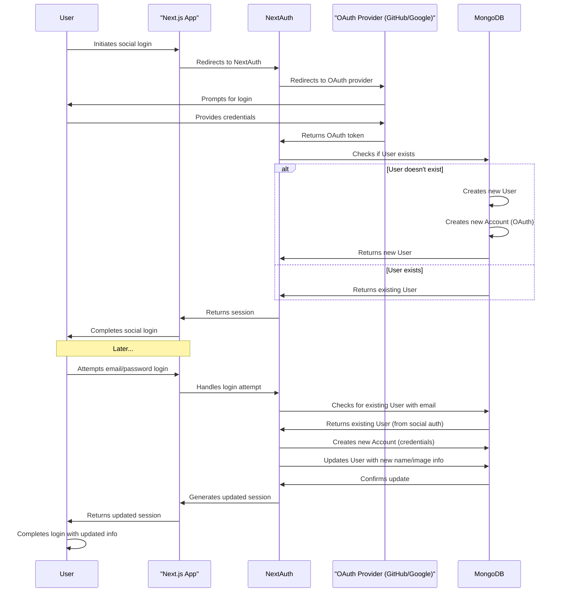

```mermaid
sequenceDiagram
    participant User
    participant "Next.js App"
    participant NextAuth
    participant "OAuth Provider (GitHub/Google)"
    participant MongoDB

    User ->> "Next.js App": Initiates social login
    "Next.js App" ->> NextAuth: Redirects to NextAuth
    NextAuth ->> "OAuth Provider (GitHub/Google)": Redirects to OAuth provider
    "OAuth Provider (GitHub/Google)" ->> User: Prompts for login
    User ->> "OAuth Provider (GitHub/Google)": Provides credentials
    "OAuth Provider (GitHub/Google)" ->> NextAuth: Returns OAuth token
    NextAuth ->> MongoDB: Checks if User exists
    alt User doesn't exist
        MongoDB ->> MongoDB: Creates new User
        MongoDB ->> MongoDB: Creates new Account (OAuth)
        MongoDB ->> NextAuth: Returns new User
    else User exists
        MongoDB ->> NextAuth: Returns existing User
    end
    NextAuth ->> "Next.js App": Returns session
    "Next.js App" ->> User: Completes social login

    Note over User, "Next.js App": Later...
    User ->> "Next.js App": Attempts email/password login
    "Next.js App" ->> NextAuth: Handles login attempt
    NextAuth ->> MongoDB: Checks for existing User with email
    MongoDB ->> NextAuth: Returns existing User (from social auth)
    NextAuth ->> MongoDB: Creates new Account (credentials)
    NextAuth ->> MongoDB: Updates User with new name/image info
    MongoDB ->> NextAuth: Confirms update
    NextAuth ->> "Next.js App": Generates updated session
    "Next.js App" ->> User: Returns updated session
    User ->> User: Completes login with updated info
```
